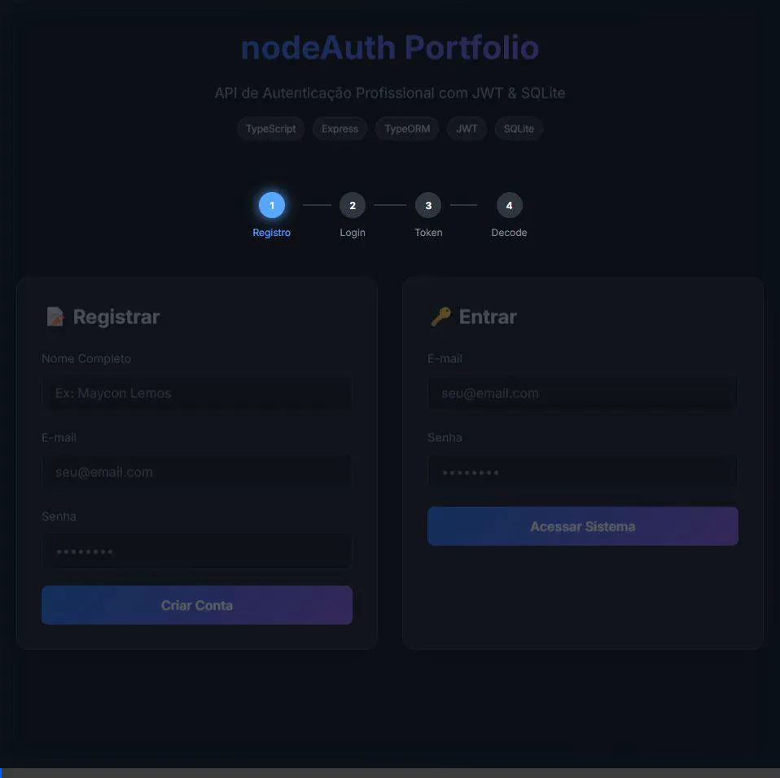

<div align="center">

# 🔐 nodeAuth

**API REST Profissional em Node.js para Autenticação JWT**

[](https://github.com/mayconlemosCloud/nodeAuth/actions/workflows/ci.yml)


</div>

## 🎬 Demonstração



## 📖 Sobre o Projeto

Esta é uma API de nível de produção construída com Node.js e TypeScript. Ela demonstra uma arquitetura limpa e modular (inspirada em princípios de Clean Architecture/DDD) para lidar com fluxos de autenticação segura de usuários.

**Principais Funcionalidades:**
- 🛡️ **Segurança JWT:** Fluxo completo de Access e Refresh tokens.
- 🏗️ **Arquitetura Modular:** Separação clara de responsabilidades entre Controllers, Services e Repositórios.
- 📦 **Banco de Dados Zero-Config:** Utiliza SQLite (via `sqlite3`) para configuração instantânea, sem necessidade de Docker ou serviços externos.
- 🧪 **Test-Driven Development:** Suíte completa de testes integrados usando Jest e Supertest.
- 🤖 **CI Automatizado:** Pipeline de GitHub Actions configurado para Linting e Testes em cada commit.
- 🎨 **Interface Moderna:** Página de demonstração inclusa, construída com Vanilla HTML/CSS/JS (design Glassmorphism).

## 🚀 Início Rápido

**Requisitos:** Node.js 18 ou superior. Não é necessário banco de dados externo ou Docker.

```bash
# 1. Clone o repositório
git clone https://github.com/mayconlemosCloud/nodeAuth.git
cd nodeAuth

# 2. Instale as dependências
npm install

# 3. Configure o ambiente
# Copie o arquivo de exemplo (já contém padrões para desenvolvimento)
cp .env.example .env

# 4. Inicie o servidor
npm run dev
# → Página de Demonstração: http://localhost:3000
# → API REST: http://localhost:3000/api
```

## 🏗️ Arquitetura

O projeto segue uma estrutura baseada em módulos, onde cada funcionalidade (Auth, User) possui sua lógica encapsulada:

```
src/
├── config/          # Validação de env (Zod) e configurações de banco
├── modules/
│   ├── auth/        # Orquestração de login e geração de JWT
│   └── user/        # Armazenamento e gerenciamento de usuários
├── middlewares/     # Guard de autenticação JWT e Handler Global de Erros
├── shared/          # Entidades centrais e utilitários compartilhados (hash/crypt)
├── app.ts           # Configuração da aplicação Express
└── server.ts        # Ponto de entrada (bootstrap)
```

## 📡 Endpoints da API

| Método | Rota | Autenticação | Descrição |
|--------|-------|------|-------------|
| POST | `/api/user` | ❌ | Criar novo usuário (registro) |
| POST | `/api/auth/login` | ❌ | Autenticar e receber tokens |
| GET | `/api/user` | ✅ | Listar todos os usuários |
| GET | `/api/user/:id` | ✅ | Ver detalhes de um usuário único |
| PUT | `/api/user/:id` | ✅ | Atualizar perfil do usuário |
| DELETE | `/api/user/:id` | ✅ | Excluir usuário |

*As rotas protegidas exigem o Header `Authorization: Bearer <JWT_TOKEN>`*

## 🧪 Testes

```bash
npm test
# Executa testes integrados para todos os cenários de autenticação
```

## 🛠️ Tecnologias Utilizadas

| Camada | Tecnologia |
|-------|-----------|
| Runtime | Node.js 18 LTS |
| Linguagem | TypeScript 5 |
| Framework | Express.js |
| ORM | TypeORM |
| Banco de Dados | SQLite (sqlite3) |
| Autenticação | jsonwebtoken + bcryptjs |
| Validação | Zod |
| Testes | Jest + ts-jest + Supertest |
| CI/CD | GitHub Actions |


